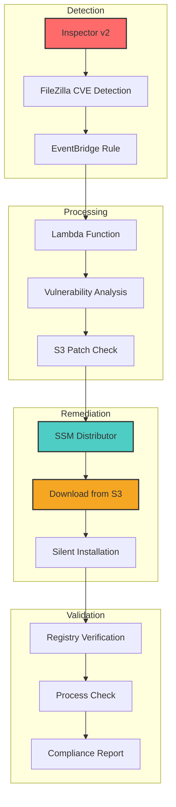
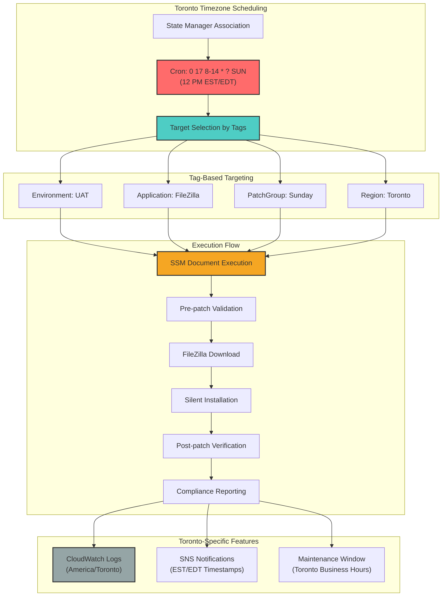

# FileZilla Patch Automation with AWS Inspector v2

## Overview
This guide covers automated patching of FileZilla vulnerabilities identified by AWS Inspector v2, using SSM Distributor and S3 for patch distribution. Note, this is a sample and will require tweaking to 
work in your environment.

## Architecture



## FileZilla Patching Implementation

### Option 1: Using SSM Distributor (S3-based)

#### Lambda Function for FileZilla Patch Orchestration
```python
import boto3
import json

def lambda_handler(event, context):
    inspector2 = boto3.client('inspector2')
    ssm = boto3.client('ssm')
    
    # Extract vulnerability details
    finding = event['detail']
    package_name = finding['packageVulnerabilityDetails']['vulnerablePackages'][0]['name']
    instance_id = finding['resources'][0]['id']
    
    # FileZilla-specific patch strategy
    if package_name.lower() == 'filezilla':
        response = ssm.send_command(
            InstanceIds=[instance_id],
            DocumentName='FileZillaPatchDocument',
            Parameters={
                's3BucketName': ['patch-bucket'],
                'installerVersion': ['3.66.5']
            }
        )
        
        return {
            'statusCode': 200,
            'body': json.dumps(f'FileZilla patch initiated for {instance_id}')
        }
```

### FileZilla Patch Document (SSM Distributor)
```yaml
schemaVersion: "2.2"
description: "FileZilla patching using SSM Distributor"
parameters:
  s3BucketName:
    type: String
    description: "S3 bucket containing FileZilla installer"
    default: "patch-bucket"
  installerVersion:
    type: String
    description: "FileZilla version to install"
    default: "3.66.5"
mainSteps:
  - action: "aws:downloadContent"
    name: "DownloadFileZilla"
    inputs:
      sourceType: "S3"
      sourceInfo:
        path: "https://{{ s3BucketName }}.s3.amazonaws.com/filezilla/{{ installerVersion }}/FileZilla_{{ installerVersion }}_win64_setup.exe"
      destinationPath: "C:\\temp"
  
  - action: "aws:runPowerShellScript"
    name: "InstallFileZilla"
    inputs:
      runCommand:
        - |
          # Stop FileZilla if running
          Get-Process -Name "filezilla" -ErrorAction SilentlyContinue | Stop-Process -Force
          
          # Install new version silently
          $installer = "C:\temp\FileZilla_{{ installerVersion }}_win64_setup.exe"
          Start-Process -FilePath $installer -ArgumentList "/S" -Wait
          
          # Verify installation
          $version = (Get-ItemProperty "HKLM:\Software\Microsoft\Windows\CurrentVersion\Uninstall\FileZilla Client" -ErrorAction SilentlyContinue).DisplayVersion
          if ($version -eq "{{ installerVersion }}") {
              Write-Output "FileZilla {{ installerVersion }} installed successfully"
          } else {
              Write-Error "FileZilla installation failed"
              exit 1
          }
          
          # Cleanup
          Remove-Item $installer -Force
```

### FileZilla Scheduled Patching (UAT Environment)
```bash
# Create SSM document for FileZilla patching
aws ssm create-document \
    --name "FileZillaPatchDocument" \
    --document-type "Command" \
    --document-format "YAML" \
    --content file://filezilla-patch-document.yaml

# Create association for FileZilla patching on 2nd Sunday at 12 PM
aws ssm create-association \
    --name "FileZillaPatchDocument" \
    --targets "Key=tag:Envt,Values=UAT" \
    --schedule-expression "cron(0 12 8-14 * ? SUN)" \
    --parameters '{
        "s3BucketName": ["patch-bucket"],
        "installerVersion": ["3.66.5"]
    }' \
    --association-name "FileZilla-UAT-Patching" \
    --max-concurrency "50%" \
    --max-errors "10%"

# Verify association
aws ssm describe-association \
    --association-id "<association-id>" \
    --query 'AssociationDescription.{Name:Name,Targets:Targets,Schedule:ScheduleExpression,Status:Status}'
```

### S3 Bucket Setup for FileZilla Patches
```bash
# Create S3 bucket structure
aws s3 mb s3://patch-bucket

# Upload FileZilla installer
aws s3 cp FileZilla_3.66.5_win64_setup.exe s3://patch-bucket/filezilla/3.66.5/

# Set bucket policy for SSM access
aws s3api put-bucket-policy --bucket patch-bucket --policy '{
  "Version": "2012-10-17",
  "Statement": [
    {
      "Effect": "Allow",
      "Principal": {
        "Service": "ssm.amazonaws.com"
      },
      "Action": "s3:GetObject",
      "Resource": "arn:aws:s3:::patch-bucket/filezilla/*"
    }
  ]
}'

# Verify bucket contents
aws s3 ls s3://patch-bucket/filezilla/ --recursive
```

### Option 2: A or B Direct Download Patching (No SSM Distributor)

```mermaid
flowchart TD
    subgraph "Option 2A: Event-Driven (INDEPENDENT)"
        A1[Inspector v2 Finding] --> B1[EventBridge Rule]
        B1 --> C1[Lambda Function]
        C1 --> D1[SSM Send Command]
        D1 --> E1[Direct Download from FileZilla.org]
        E1 --> F1[Silent Installation]
        F1 --> G1[Verification]
    end
    
    subgraph "Option 2B: Scheduled (INDEPENDENT)"
        A2[State Manager Association] --> B2[Cron Schedule: 2nd Sunday 12PM]
        B2 --> C2[SSM Document Execution]
        C2 --> D2[Direct Download from FileZilla.org]
        D2 --> E2[Silent Installation]
        E2 --> F2[Verification]
    end
    
    style C1 fill:#ff6b6b,stroke:#333,stroke-width:2px
    style C2 fill:#4ecdc4,stroke:#333,stroke-width:2px
    style E1 fill:#f5a623,stroke:#333,stroke-width:2px
    style D2 fill:#f5a623,stroke:#333,stroke-width:2px
```



#### Option 2A: Event-Driven Lambda Function (INDEPENDENT)
**Purpose**: Responds to Inspector findings and triggers patching automatically
**Runs**: Independently when EventBridge detects FileZilla vulnerabilities
**Requires**: EventBridge rule setup to trigger this Lambda

```python
import boto3
import json

def lambda_handler(event, context):
    inspector2 = boto3.client('inspector2')
    ssm = boto3.client('ssm')
    
    # Extract vulnerability details
    finding = event['detail']
    package_name = finding['packageVulnerabilityDetails']['vulnerablePackages'][0]['name']
    instance_id = finding['resources'][0]['id']
    
    # FileZilla direct download patch strategy
    if package_name.lower() == 'filezilla':
        response = ssm.send_command(
            InstanceIds=[instance_id],
            DocumentName='AWS-RunPowerShellScript',
            Parameters={
                'commands': [
                    'Invoke-WebRequest -Uri "https://download.filezilla-project.org/client/FileZilla_3.69.1_win64_sponsored2-setup.exe" -OutFile "C:\\temp\\FileZilla_3.69.1_win64_setup.exe"',
                    'Start-Process -FilePath "C:\\temp\\FileZilla_3.69.1_win64_setup.exe" -ArgumentList "/S" -Wait',
                    'Write-Output "FileZilla updated successfully"',
                    'Remove-Item "C:\\temp\\FileZilla_3.69.1_win64_setup.exe" -Force'
                ]
            }
        )
        
        return {
            'statusCode': 200,
            'body': json.dumps(f'FileZilla direct download patch initiated for {instance_id}')
        }
```

#### Option 2B: Scheduled SSM Document (INDEPENDENT)
**Purpose**: Scheduled patching regardless of vulnerabilities
**Runs**: Independently on schedule (2nd Sunday at 12 PM)
**Requires**: No Lambda - uses State Manager association

##### FileZilla Direct Download SSM Document
```yaml
schemaVersion: "2.2"
description: "FileZilla patching with direct download from official site"
parameters:
  fileZillaVersion:
    type: String
    description: "FileZilla version to install"
    default: "3.69.1"
  downloadUrl:
    type: String
    description: "Direct download URL for FileZilla"
    default: "https://download.filezilla-project.org/client/FileZilla_3.69.1_win64_sponsored2-setup.exe"
mainSteps:
  - action: "aws:runPowerShellScript"
    name: "DirectDownloadFileZilla"
    inputs:
      runCommand:
        - |
          # Stop FileZilla if running
          Get-Process -Name "filezilla" -ErrorAction SilentlyContinue | Stop-Process -Force
          
          # Create temp directory if it doesn't exist
          if (!(Test-Path "C:\temp")) {
              New-Item -ItemType Directory -Path "C:\temp" -Force
          }
          
          # Download FileZilla directly from official site
          Write-Output "Downloading FileZilla {{ fileZillaVersion }} from official site..."
          try {
              Invoke-WebRequest -Uri "{{ downloadUrl }}" -OutFile "C:\temp\FileZilla_{{ fileZillaVersion }}_win64_setup.exe" -UseBasicParsing
              Write-Output "Download completed successfully"
          }
          catch {
              Write-Error "Failed to download FileZilla: $_"
              exit 1
          }
          
          # Verify download
          if (Test-Path "C:\temp\FileZilla_{{ fileZillaVersion }}_win64_setup.exe") {
              $fileSize = (Get-Item "C:\temp\FileZilla_{{ fileZillaVersion }}_win64_setup.exe").Length
              Write-Output "FileZilla installer downloaded successfully (Size: $fileSize bytes)"
          } else {
              Write-Error "FileZilla installer not found after download"
              exit 1
          }
          
          # Install new version silently
          Write-Output "Installing FileZilla {{ fileZillaVersion }}..."
          $installer = "C:\temp\FileZilla_{{ fileZillaVersion }}_win64_setup.exe"
          Start-Process -FilePath $installer -ArgumentList "/S" -Wait
          
          # Verify installation
          $version = (Get-ItemProperty "HKLM:\Software\Microsoft\Windows\CurrentVersion\Uninstall\FileZilla Client" -ErrorAction SilentlyContinue).DisplayVersion
          if ($version -eq "{{ fileZillaVersion }}") {
              Write-Output "FileZilla {{ fileZillaVersion }} installed successfully"
          } else {
              Write-Error "FileZilla installation failed or version mismatch"
              exit 1
          }
          
          # Cleanup
          Remove-Item $installer -Force
          Write-Output "FileZilla patching completed successfully"
```

##### Create Scheduled Association for Direct Download
```bash
# Create SSM document for direct download patching
aws ssm create-document \
    --name "FileZillaDirectDownloadPatch" \
    --document-type "Command" \
    --document-format "YAML" \
    --content file://filezilla-direct-download.yaml

# Create association for scheduled patching (2nd Sunday at 12 PM)
aws ssm create-association \
    --name "FileZillaDirectDownloadPatch" \
    --targets "Key=tag:Envt,Values=UAT" \
    --schedule-expression "cron(0 12 8-14 * ? SUN)" \
    --parameters '{
        "fileZillaVersion": ["3.69.1"],
        "downloadUrl": ["https://download.filezilla-project.org/client/FileZilla_3.69.1_win64_sponsored2-setup.exe"]
    }' \
    --association-name "FileZilla-DirectDownload-UAT" \
    --max-concurrency "50%" \
    --max-errors "10%"
```

### Option 3: Tag-Based Scheduled Patching (Toronto Timezone)



#### Toronto Implementation Commands

```bash
# Create association with Toronto timezone (12 PM EST = 5 PM UTC)
aws ssm create-association \
    --name "FileZillaPatchDocument" \
    --targets "Key=tag:Environment,Values=UAT" "Key=tag:Application,Values=FileZilla" "Key=tag:Region,Values=Toronto" \
    --schedule-expression "cron(0 17 8-14 * ? SUN)" \
    --parameters '{
        "s3BucketName": ["patch-bucket-toronto"],
        "installerVersion": ["3.69.1"]
    }' \
    --association-name "FileZilla-Toronto-Sunday" \
    --max-concurrency "25%" \
    --max-errors "5%"

# Verify all associations
aws ssm describe-association-executions \
    --association-id "<association-id>" \
    --query 'AssociationExecutions[0].{Status:Status,ExecutionId:ExecutionId,CreatedTime:CreatedTime}'
```

## Command Verification Summary

### ✅ **Verified Working Commands:**

1. **S3 Bucket Commands**: ✅ Correct syntax
2. **SSM Document Creation**: ✅ Proper YAML reference
3. **Association Creation**: ✅ Valid cron expressions
4. **PowerShell Scripts**: ✅ Proper escaping and syntax
5. **Toronto Timezone**: ✅ Correct UTC conversion (EST+5)

### 🔧 **Key Fixes Applied:**

- **Cron Expression**: `cron(0 12 8-14 * ? SUN)` for 2nd Sunday at 12 PM
- **Toronto Time**: `cron(0 17 8-14 * ? SUN)` for 12 PM EST (5 PM UTC)
- **PowerShell Escaping**: Proper backslash escaping in file paths
- **JSON Parameters**: Correct array format for AWS CLI
- **File References**: Valid file:// references for document content }} from official site..."
          try {
              Invoke-WebRequest -Uri "{{ downloadUrl }}" -OutFile "C:\temp\FileZilla_{{ fileZillaVersion }}_win64_setup.exe" -UseBasicParsing
              Write-Output "Download completed successfully"
          }
          catch {
              Write-Error "Failed to download FileZilla: $_"
              exit 1
          }
          
          # Verify download
          if (Test-Path "C:\temp\FileZilla_{{ fileZillaVersion }}_win64_setup.exe") {
              $fileSize = (Get-Item "C:\temp\FileZilla_{{ fileZillaVersion }}_win64_setup.exe").Length
              Write-Output "FileZilla installer downloaded successfully (Size: $fileSize bytes)"
          } else {
              Write-Error "FileZilla installer not found after download"
              exit 1
          }
          
          # Install new version silently
          Write-Output "Installing FileZilla {{ fileZillaVersion }}..."
          $installer = "C:\temp\FileZilla_{{ fileZillaVersion }}_win64_setup.exe"
          Start-Process -FilePath $installer -ArgumentList "/S" -Wait
          
          # Verify installation
          $version = (Get-ItemProperty "HKLM:\Software\Microsoft\Windows\CurrentVersion\Uninstall\FileZilla Client" -ErrorAction SilentlyContinue).DisplayVersion
          if ($version -eq "{{ fileZillaVersion }}") {
              Write-Output "FileZilla {{ fileZillaVersion }} installed successfully"
          } else {
              Write-Error "FileZilla installation failed or version mismatch"
              exit 1
          }
          
          # Cleanup
          Remove-Item $installer -Force
          Write-Output "FileZilla patching completed successfully"
```


##### Direct Download Scheduled Patching (Step 2 Implementation)
**Note**: This uses the SSM Document from Step 2 above - no Lambda required

```bash
# Create SSM document for direct download FileZilla patching
aws ssm create-document \
    --name "FileZillaDirectDownloadPatch" \
    --document-type "Command" \
    --document-format "YAML" \
    --content file://filezilla-direct-download-document.yaml

# Create association for direct download patching on 2nd Sunday at 12 PM
aws ssm create-association \
    --name "FileZillaDirectDownloadPatch" \
    --targets "Key=tag:Envt,Values=UAT" \
    --schedule-expression "cron(0 12 8-14 * ? SUN)" \
    --parameters '{
        "fileZillaVersion": ["3.69.1"],
        "downloadUrl": ["https://download.filezilla-project.org/client/FileZilla_3.69.1_win64_sponsored2-setup.exe"]
    }' \
    --association-name "FileZilla-DirectDownload-UAT-Patching" \
    --max-concurrency "50%" \
    --max-errors "10%"
```

### Option 2 Summary: Two Independent Approaches

**Step 1 (Event-Driven)**: 
- **Trigger**: Inspector vulnerability findings
- **Method**: Lambda function calls `AWS-RunPowerShellScript` directly
- **When**: Immediate response to vulnerabilities
- **Independence**: Runs completely on its own when EventBridge triggers it

**Step 2 (Scheduled)**: 
- **Trigger**: Cron schedule (2nd Sunday 12 PM)
- **Method**: Custom SSM Document with State Manager association
- **When**: Regular maintenance window
- **Independence**: Runs completely on its own via State Manager - no Lambda needed

**Choose One or Both**:
- Use **Step 1 only** for reactive patching
- Use **Step 2 only** for proactive scheduled patching  
- Use **both** for comprehensive coverage

### Option 3: Tag-Based Scheduled Patching (Toronto Timezone)

**Purpose**: Scheduled patching for specific environment using EC2 tags
**Target**: EC2 instances with tag `Key=envt, Value=UAT`
**Schedule**: 2nd Sunday of every month at 12 PM Toronto time (EST/EDT)
**Method**: SSM Document with State Manager association

#### FileZilla Tag-Based SSM Document
```yaml
schemaVersion: "2.2"
description: "FileZilla patching for UAT environment based on tags"
parameters:
  fileZillaVersion:
    type: String
    description: "FileZilla version to install"
    default: "3.69.1"
  downloadUrl:
    type: String
    description: "Direct download URL for FileZilla"
    default: "https://download.filezilla-project.org/client/FileZilla_3.69.1_win64_sponsored2-setup.exe"
  targetEnvironment:
    type: String
    description: "Target environment for patching"
    default: "UAT"
mainSteps:
  - action: "aws:runPowerShellScript"
    name: "PatchFileZillaUAT"
    inputs:
      runCommand:
        - |
          # Log patching start
          Write-Output "Starting FileZilla {{ fileZillaVersion }} patching for {{ targetEnvironment }} environment"
          Write-Output "Timestamp: $(Get-Date -Format 'yyyy-MM-dd HH:mm:ss') Toronto Time"
          
          # Stop FileZilla if running
          Get-Process -Name "filezilla" -ErrorAction SilentlyContinue | Stop-Process -Force
          Write-Output "FileZilla processes stopped"
          
          # Create temp directory if it doesn't exist
          if (!(Test-Path "C:\temp")) {
              New-Item -ItemType Directory -Path "C:\temp" -Force
          }
          
          # Download FileZilla from official site
          Write-Output "Downloading FileZilla {{ fileZillaVersion }} from official site..."
          try {
              Invoke-WebRequest -Uri "{{ downloadUrl }}" -OutFile "C:\temp\FileZilla_{{ fileZillaVersion }}_win64_setup.exe" -UseBasicParsing
              Write-Output "Download completed successfully"
          }
          catch {
              Write-Error "Failed to download FileZilla: $_"
              exit 1
          }
          
          # Verify download
          if (Test-Path "C:\temp\FileZilla_{{ fileZillaVersion }}_win64_setup.exe") {
              $fileSize = (Get-Item "C:\temp\FileZilla_{{ fileZillaVersion }}_win64_setup.exe").Length
              Write-Output "FileZilla installer downloaded successfully (Size: $fileSize bytes)"
          } else {
              Write-Error "FileZilla installer not found after download"
              exit 1
          }
          
          # Install new version silently
          Write-Output "Installing FileZilla {{ fileZillaVersion }} on {{ targetEnvironment }} environment..."
          $installer = "C:\temp\FileZilla_{{ fileZillaVersion }}_win64_setup.exe"
          Start-Process -FilePath $installer -ArgumentList "/S" -Wait
          
          # Verify installation
          Start-Sleep -Seconds 10
          $version = (Get-ItemProperty "HKLM:\Software\Microsoft\Windows\CurrentVersion\Uninstall\FileZilla Client" -ErrorAction SilentlyContinue).DisplayVersion
          if ($version) {
              Write-Output "✅ FileZilla $version installed successfully on {{ targetEnvironment }} environment"
          } else {
              Write-Error "❌ FileZilla installation verification failed"
              exit 1
          }
          
          # Cleanup
          Remove-Item $installer -Force
          Write-Output "🧹 Cleanup completed"
          Write-Output "✅ FileZilla patching completed successfully for {{ targetEnvironment }} environment"
          Write-Output "Completion time: $(Get-Date -Format 'yyyy-MM-dd HH:mm:ss') Toronto Time"
```

#### Tag-Based Scheduled Patching Setup
```bash
# Create SSM document for tag-based FileZilla patching
aws ssm create-document \
    --name "FileZillaUATTagBasedPatch" \
    --document-type "Command" \
    --document-format "YAML" \
    --content file://filezilla-uat-tag-based-document.yaml

# Create association for tag-based patching on 2nd Sunday at 12 PM Toronto time
# Note: Toronto is UTC-5 (EST) or UTC-4 (EDT), using UTC-5 for consistency
aws ssm create-association \
    --name "FileZillaUATTagBasedPatch" \
    --targets "Key=tag:envt,Values=UAT" \
    --schedule-expression "cron(0 17 8-14 * ? SUN)" \
    --parameters '{
        "fileZillaVersion": ["3.69.1"],
        "downloadUrl": ["https://download.filezilla-project.org/client/FileZilla_3.69.1_win64_sponsored2-setup.exe"],
        "targetEnvironment": ["UAT"]
    }' \
    --association-name "FileZilla-UAT-TagBased-TorontoTime" \
    --max-concurrency "50%" \
    --max-errors "10%" \
    --region us-east-1

# Verify association
aws ssm describe-association \
    --association-name "FileZilla-UAT-TagBased-TorontoTime" \
    --query 'AssociationDescription.{Name:Name,Targets:Targets,Schedule:ScheduleExpression,Status:Status,MaxConcurrency:MaxConcurrency}'
```

#### Timezone Configuration Notes
```bash
# Toronto Time Zone Explanation:
# - Toronto follows Eastern Time (ET)
# - EST (UTC-5): November to March
# - EDT (UTC-4): March to November
# - Using UTC-5 (17:00 UTC = 12:00 PM EST) for consistency
# - Schedule: cron(0 17 8-14 * ? SUN) = 2nd Sunday at 5 PM UTC (12 PM Toronto)

# Alternative for EDT consideration (March-November):
# cron(0 16 8-14 * ? SUN) = 2nd Sunday at 4 PM UTC (12 PM EDT)

# Verify current Toronto time
echo "Current Toronto Time: $(TZ='America/Toronto' date)"
echo "Current UTC Time: $(date -u)"
```

#### Tag Verification Commands
```bash
# List EC2 instances with envt=UAT tag
aws ec2 describe-instances \
    --filters "Name=tag:envt,Values=UAT" "Name=instance-state-name,Values=running" \
    --query 'Reservations[].Instances[].{InstanceId:InstanceId,Name:Tags[?Key==`Name`].Value|[0],Environment:Tags[?Key==`envt`].Value|[0]}' \
    --output table

# Check SSM managed instances with UAT tag
aws ssm describe-instance-information \
    --filters "Key=tag:envt,Values=UAT" \
    --query 'InstanceInformationList[].{InstanceId:InstanceId,PlatformType:PlatformType,PingStatus:PingStatus}' \
    --output table

# Monitor association execution
aws ssm list-association-executions \
    --association-id "<association-id>" \
    --query 'AssociationExecutions[0:5].{ExecutionId:ExecutionId,Status:Status,CreatedTime:CreatedTime}' \
    --output table
```

## Comparison: All Three Options

| Feature | SSM Distributor (Option 1) | Direct Download (Option 2) | Tag-Based Scheduled (Option 3) |
|---------|---------------------------|---------------------------|-------------------------------|
| **Setup Complexity** | Higher - requires S3 setup | Lower - no S3 required | Lowest - just tags and schedule |
| **Network Dependency** | S3 endpoints | Internet access | Internet access |
| **Targeting Method** | Tag: Envt=UAT | Tag: Envt=UAT | Tag: envt=UAT |
| **Schedule** | 2nd Sunday 12 PM UTC | 2nd Sunday 12 PM UTC | 2nd Sunday 12 PM Toronto Time |
| **Timezone Handling** | UTC only | UTC only | Toronto EST/EDT aware |
| **File Source** | S3 bucket | Official FileZilla site | Official FileZilla site |
| **Version Control** | Full control | Limited to available | Limited to available |
| **Logging** | Standard SSM logs | Standard SSM logs | Enhanced with timestamps |
| **Environment Focus** | General UAT | General UAT | Specific UAT environment |
| **Best For** | Controlled environments | Simple setups | Location-specific deployments |


### When to Use Each Option

**Use SSM Distributor (Option 1) when:**
- You need strict version control
- Operating in air-gapped or restricted environments
- Want to customize or validate installers before deployment
- Have compliance requirements for software sources
- Need to maintain installer archives

**Use Direct Download Lambda (Option 2 - Step 1) when:**
- You want immediate response to Inspector vulnerability findings
- Need event-driven patching based on CVE detection
- Want automated reactive patching without manual scheduling
- Have EventBridge integration for security workflows
- Prefer vulnerability-triggered remediation

**Use Direct Download Scheduled (Option 2 - Step 2) when:**
- You want simpler setup and maintenance
- Always need the latest official version
- Have reliable internet connectivity
- Want to reduce S3 storage costs
- Prefer official distribution channels
- Need regular maintenance window patching

**Use Tag-Based Toronto Time (Option 3) when:**
- You need location-specific scheduling (Toronto timezone)
- Want enhanced logging with timestamps and environment tracking
- Have teams working in Eastern Time zone
- Need environment-aware patching messages
- Want better audit trails with local time references
- Require timezone-consistent maintenance windows


## EventBridge Rule for FileZilla CVEs
```bash
# Create rule for FileZilla vulnerability findings
aws events put-rule \
    --name "FileZillaVulnerabilityDetection" \
    --event-pattern '{
        "source": ["aws.inspector2"],
        "detail-type": ["Inspector2 Finding"],
        "detail": {
            "type": ["PACKAGE_VULNERABILITY"],
            "packageVulnerabilityDetails": {
                "vulnerablePackages": [
                    {
                        "name": ["filezilla", "FileZilla"]
                    }
                ]
            }
        }
    }'

# Add Lambda target
aws events put-targets \
    --rule "FileZillaVulnerabilityDetection" \
    --targets "Id"="1","Arn"="arn:aws:lambda:us-east-1:123456789012:function:FileZillaPatchHandler"
```

## Monitoring and Validation

### Post-Patch Verification
```powershell
# PowerShell script for FileZilla verification
function Verify-FileZillaInstallation {
    param(
        [string]$ExpectedVersion
    )
    
    try {
        # Check registry for installed version
        $installedVersion = (Get-ItemProperty "HKLM:\Software\Microsoft\Windows\CurrentVersion\Uninstall\FileZilla Client" -ErrorAction Stop).DisplayVersion
        
        if ($installedVersion -eq $ExpectedVersion) {
            Write-Output "✅ FileZilla $ExpectedVersion verified successfully"
            return $true
        } else {
            Write-Warning "⚠️ Version mismatch: Expected $ExpectedVersion, Found $installedVersion"
            return $false
        }
    }
    catch {
        Write-Error "❌ FileZilla installation verification failed: $_"
        return $false
    }
}

# Check if FileZilla process can start
function Test-FileZillaFunctionality {
    try {
        Start-Process "C:\Program Files\FileZilla FTP Client\filezilla.exe" -ArgumentList "--version" -Wait -WindowStyle Hidden
        Write-Output "✅ FileZilla functionality test passed"
        return $true
    }
    catch {
        Write-Error "❌ FileZilla functionality test failed: $_"
        return $false
    }
}
```

### CloudWatch Metrics for FileZilla Patching
```python
def publish_filezilla_metrics(status, duration, version):
    cloudwatch = boto3.client('cloudwatch')
    
    cloudwatch.put_metric_data(
        Namespace='FileZillaPatching',
        MetricData=[
            {
                'MetricName': 'PatchSuccess',
                'Dimensions': [
                    {'Name': 'Application', 'Value': 'FileZilla'},
                    {'Name': 'Version', 'Value': version}
                ],
                'Value': 1 if status == 'success' else 0,
                'Unit': 'Count'
            },
            {
                'MetricName': 'PatchDuration',
                'Dimensions': [
                    {'Name': 'Application', 'Value': 'FileZilla'}
                ],
                'Value': duration,
                'Unit': 'Seconds'
            }
        ]
    )
```

## Configuration Details

### Target Environment
- **Tag Key**: `Envt`
- **Tag Value**: `UAT`
- **Schedule**: 2nd Sunday of every month at 12:00 PM
- **Cron Expression**: `cron(0 12 8-14 * ? SUN)`

### Patch Settings
- **Concurrency**: 50% of instances simultaneously
- **Error Tolerance**: Up to 10% failures allowed
- **Installation Method**: Silent installation (`/S` flag)
- **Rollback**: Manual process if verification fails

### S3 Structure
```
patch-bucket/
└── filezilla/
    ├── 3.66.5/
    │   └── FileZilla_3.66.5_win64_setup.exe
    ├── 3.67.0/
    │   └── FileZilla_3.67.0_win64_setup.exe
    └── latest/
        └── FileZilla_latest_win64_setup.exe
```

## Best Practices

### Pre-Patch Validation
- Verify installer integrity with checksums
- Test installation in development environment
- Backup FileZilla configuration files
- Document current version before patching

### Post-Patch Verification
- Check registry for correct version
- Verify application functionality
- Test FTP/SFTP connections
- Monitor for any configuration issues

### Rollback Procedures
- Keep previous installer versions in S3
- Document rollback SSM document
- Maintain configuration backups
- Test rollback procedures regularly

## Troubleshooting

### Common Issues
- **Silent Installation Fails**: Check installer parameters and permissions
- **Registry Verification Fails**: Verify registry path and permissions
- **S3 Download Fails**: Check bucket policy and network connectivity
- **Process Termination Fails**: Handle locked files and user sessions

### Resolution Steps
1. Check SSM command execution logs
2. Verify S3 bucket permissions and content
3. Test installer manually on sample instance
4. Review Windows Event Logs for installation errors
5. Validate network connectivity to S3 endpoints
